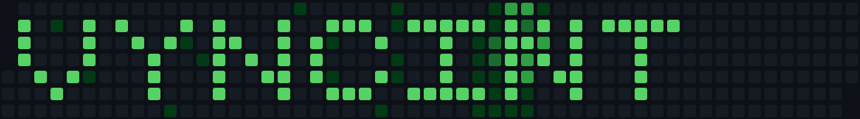

# mossaic

**Make your GitHub contribution graph spell something.** Tell mossaic that 2027
should read VYNCINT and it works backwards to a number of commits for *today* —
then tells you each morning whether you are on pace, and says plainly when the
year can no longer be drawn cleanly.

And it shows you the result, in your terminal, as real pixels: GitHub's own
Primer colours at github.com's own geometry, with a tooltip that follows the
mouse.

[](https://github.com/vyncint/mossaic/actions/workflows/ci.yml)
[](https://crates.io/crates/mossaic)
[](https://docs.rs/mossaic)
[](https://github.com/vyncint/mossaic/blob/main/Cargo.toml)
[](#license)



That is 2027, planned and drawn — bright letters on a **light green field**
rather than on an empty graph, so every day of the year stays green. Two
commands, and the second is the one that made the image above:

```sh
mossaic-art VYNCINT --year 2027 --background 1 --snapshot /tmp/art.json
mossaic --file /tmp/art.json --today 2027-12-31 --cell 9x19 --png chart.png
```

Every cell there is an image — anti-aliased rounded squares sent over the kitty
graphics protocol or sixel, lined up exactly with the character cells so the
labels around them stay text.

## Contents

**Start here** · [Quickstart](#quickstart) ·
[Writing text into the graph](docs/ART.md) ·
[The GitHub Action](action/README.md)

**Reference** · [Install](#install) · [Usage](#usage) ·
[What you can draw](#what-you-can-draw) ·
[Pixel art across the year](#pixel-art-across-the-year) ·
[Keys](#keys) · [Mouse](#mouse) ·
[How it works](#how-it-works) · [Known limits](#known-limits) ·
[Design notes](docs/DESIGN.md) · [Contributing](CONTRIBUTING.md) ·
[Changelog](CHANGELOG.md)

## Quickstart

**No Rust needed.** Every release ships static binaries for Linux, macOS and
Windows, on Intel and arm64 alike.

```sh
brew install vyncint/tap/mossaic
```

Or download one — still no toolchain:

```sh
target=x86_64-unknown-linux-musl     # or aarch64-unknown-linux-musl,
                                     # aarch64-apple-darwin, x86_64-apple-darwin
curl -fsSL "https://github.com/vyncint/mossaic/releases/latest/download/mossaic-${target}.tar.gz" \
  | tar xz --strip-components=1 --wildcards '*/mossaic*'
```

Windows: take the `.zip` from the
[latest release](https://github.com/vyncint/mossaic/releases/latest).
Already have Rust? `cargo install mossaic --locked`.

[All the ways to install](#install), including checksum verification, are
below.

**Plan the art.** No account, no network — this is arithmetic:

```sh
mossaic-art VYNCINT --year 2027 --background 1 --save
```

**Then, every morning:**

```sh
gh auth login              # once; mossaic never handles a token itself
mossaic-art --track        # how far along, and what today owes
```

```
  letters     ██████████████████░░░░░░░░░░  50 of 75 bright
  owing       25 day(s) short, 100 contributions between them

  VYNCINT can still be drawn cleanly — 100 contributions to go.
```

*(A year part-way through; yours will read differently. The full report, on a
calendar you can reproduce exactly, is in [docs/ART.md](docs/ART.md#tracking-it-day-by-day).)*

**And to look at any graph**, whether or not you are drawing in it:

```sh
mossaic --demo             # a sample year: no account, no network
mossaic                    # yours
```

Press `?` in it for the keys, the mouse, and — the question everything else
depends on — **what your terminal turned out to be able to draw**.

<details>
<summary>Not seeing rounded pixel cells?</summary>

Two things decide it, and `mossaic --capabilities` tells you both:

```
terminal   TERM=xterm-kitty
kitty      yes          <- the protocol
sixel      no
cell       9x19 px      <- the size, needed to line an image up with the labels
background #0d1117  (Dark theme)
cells      kitty
```

- **`cells text`** means the terminal draws neither protocol. kitty, Ghostty,
  WezTerm, foot, Konsole, iTerm2, mlterm, Windows Terminal and
  `xterm -ti vt340` all draw one of them; GNOME Terminal and Ptyxis draw
  neither, because VTE ships sixel switched off. Nothing is lost but the
  pixels — the chart still draws in block sextants.
- **A window under 112 columns** falls back too, and the chart says so under the
  legend, naming the number it wants.
- Either way, `mossaic --png chart.png` renders the same image to a file from
  any terminal at all.

</details>

## Why

Your contribution graph is probably the chart you look at most often and have
thought about least. It renders in someone else's tab, identically for everyone,
and reports one thing, after the fact: whether you showed up.

**mossaic turns it from a scoreboard into a canvas.** Contribution art is
usually done blind — generate thousands of commits, push, and find out. Here the
year is arithmetic before it is commits: what each lit day costs (every day's
shade is relative to your busiest one), where to place the text so existing days
do not punch holes in it, and whether it is still reachable in September.

Ask it about a year you have already been committing in and it says so, with the
placement that would salvage the most:

```
  VYNCINT cannot be drawn cleanly in 2026.
    61 day(s) inside the letters already have contributions, and
    nothing takes those away — the text would read with holes in it.
    --start-week 1 would leave 23 instead of 61.
```

**A field beats an empty graph.** Letters on nothing means not contributing on
the other 290 days of the year. `--background 1` draws the background as a shade
instead, so the art is one green against another and the year stays alive — the
image at the top of this page, at 590 commits for the whole of 2027.

GitHub's five shades are not evenly spaced, so mossaic measures the pair you
picked in CIELAB across all nine palettes GitHub ships and tells you what a
reader will actually see: `ΔE 35 at worst, clear`. Leave two levels between them
and it is legible everywhere; leave one and it is not.

**And it draws the result honestly**, so you can check the picture before making
a single commit. Primer tokens read from the stylesheets github.com serves.
github.com's own geometry — an 11px square on a 14px pitch, the hairline border
*over* the square's edge rather than inset into it — kept as a ratio and scaled
to whatever a character cell measures. Nothing is approximated for the
terminal's convenience: when GitHub restyles the graph, a test in here is what
should fail.

The whole art guide — placement, cost, saving the plan, running the tracker on a
schedule — is **[docs/ART.md](docs/ART.md)**; the Action that posts it to Slack,
Discord or email is **[action/README.md](action/README.md)**.

## Usage

Three binaries, and every option has a default — the first line of each block is
the whole command you need.

```sh
mossaic                          # you, this year
mossaic --demo                   # a sample year: no account, no network
mossaic octocat --year 2024      # someone else, some year
mossaic --file saved.json        # a saved calendar, no network
```

```sh
mossaic --capabilities           # what your terminal can draw
mossaic --png chart.png          # the chart as an image, from any terminal
mossaic --graphics sixel         # force a protocol, or `text` for no pixels
mossaic --cell 10x20             # when the terminal will not say how big a cell is
mossaic --today 2027-06-30       # read the year as of a day, not the clock
mossaic --theme light            # instead of following the terminal's background
mossaic --palette winter         # GitHub's own seasonal colours
mossaic --no-mouse               # leave mouse reporting alone
```

```sh
mossaic-art VYNCINT --year 2027 --background 1   # draw text on a field
mossaic-art "I :heart: RUST" --year 2027         # shapes, among the letters
mossaic-art --font                               # every glyph it can draw
mossaic-art --track                              # how far along the plan is
mossaic-art --track --today 2027-06-01           # what a day still to come will owe
mossaic-art --backfill --repo ../art             # commit just what the plan is short
mossaic-glyphs                                   # this terminal's fallback cells
```

From a checkout, `cargo run -- …` and `cargo run --bin mossaic-art -- …` are
the same commands.

## What you can draw

A glyph is 5×5 days with a blank column between, placed on Mon–Fri so the
weekends stay clear. That makes **eight glyphs the limit** for one year.


That is the whole font, drawn by the same rasteriser that draws the chart — real
Primer greens, github.com's own square on github.com's own pitch, bright glyphs
on a level-1 field. It is an image rather than a table of characters for the
same reason the sextant chart is no longer on this page: half of these symbols
are ones a browser may have no font for, and a picture of the cells has nothing
to be missing. `mossaic-art --font` draws the same set in your own terminal, and
`--png` writes this file:

```sh
mossaic-art --font                      # in the terminal
mossaic-art --font --png art/font.png   # the sheet above
```

**Letters and digits.** Lowercase draws the uppercase glyph, so `vyncint` and
`VYNCINT` are the same picture:

```
A B C D E F G H I J K L M N O P Q R S T U V W X Y Z
0 1 2 3 4 5 6 7 8 9
```

**Punctuation**, and space:

```
- . ! ? , ' " + = < > ( ) / \ * _ @ & # %
```

**Shapes**, written between colons — `mossaic-art "I :heart: RUST"`. They are
the last nineteen glyphs of the sheet above, in this order. The name is the
reliable way in; paste the symbol or the emoji instead if you can type one, and
it draws the same glyph:

| | write | or paste |
| --- | --- | --- |
| ★ | `:star:` | ⭐ ☆ ✩ ✭ |
| ♥ | `:heart:` `:love:` | ❤ ♡ 💙 💚 💜 🧡 |
| ☺ | `:smile:` `:happy:` | ☻ 😀 😃 🙂 😊 |
| ☹ | `:sad:` `:cry:` `:frown:` | 🙁 😢 😭 |
| ✓ | `:check:` `:tick:` | ✔ ✅ |
| ● | `:circle:` `:dot:` | ○ ⬤ |
| □ | `:square:` | ■ ◻ ◼ |
| ▲ | `:triangle:` | △ |
| ◆ | `:diamond:` | ◇ |
| ♪ | `:note:` `:music:` | ♫ 🎵 |
| ☀ | `:sun:` | 🌞 |
| ☾ | `:moon:` | 🌙 ☽ |
| ⚡ | `:bolt:` `:zap:` | 🗲 |
| ↑ ↓ ← → | `:up:` `:down:` `:left:` `:right:` | |
| ☠ | `:skull:` | 💀 |
| ✿ | `:flower:` | 🌸 🌷 |

A colon always opens a shape name, so `:` has no glyph of its own — which is
what keeps the grammar to one reading. A name nobody has drawn, or a colon that
closes nothing, is refused with the list above rather than guessed at.

Adding a glyph is one table entry in `src/art.rs` — the shape rules are checked
when the crate compiles. See
[CONTRIBUTING.md](CONTRIBUTING.md#10-adding-a-glyph-to-the-font).

## Pixel art across the year

The font draws five rows of two shades on Mon–Fri. A **canvas** is the general
case: seven rows, up to 53 columns, any of GitHub's five shades on any day —
the weekend included, and the whole year at once.


That is `--template dragon` on 2027 — 146 days, 442 commits — drawn by the same
rasteriser that draws the chart, so it is what the graph will actually look
like rather than an impression of it.

Four templates ship with it — `dragon`, `wave`, `pulse` and `invader` — and
each is a seven-line text file you can copy and edit.

```sh
mossaic-art --list-templates                    # what there is, with thumbnails
mossaic-art --template dragon --year 2027       # draw one, and see what it costs
mossaic-art --draw                              # draw your own, by hand
mossaic-art --matrix mine.art --year 2027       # draw a file you made
mossaic-art --image logo.png --year 2027        # turn a picture into a year
```

Everything a text plan does, a picture does: `--track` reports how far along it
is, `--save` remembers it, `--backfill` catches up, `--write` makes the commits,
and the GitHub Action reads the same JSON.

### The `.art` format

Seven rows of shades, and a header that introduces the picture:

```
# name: Dragon
# author: @vyncint
# description: A serpentine dragon coiling across the whole year

0000000000000000000003333333333333300000330000000000
...
```

Shades are `0`–`4`, or the blocks ` ░▒▓█` if you would rather read the file as
a picture. A short row is padded with dark days, so an editor that strips
trailing whitespace cannot corrupt one. Dropping a file into `art/templates/`
is all it takes to add a template — `build.rs` finds it, and there is no list
to edit. See [CONTRIBUTING §11](CONTRIBUTING.md#11-adding-a-pixel-art-template).

> **Draw one?** [#57](https://github.com/vyncint/mossaic/issues/57) is an open
> invitation with the whole thing written out — the editor's keys, the format,
> what gets merged, and a list of ideas to claim. **No Rust needed:** a
> template is a text file, and there is no list to add it to.

**Use three shades, and use `0`, `2` and `4`.** GitHub's five greens are not
evenly spaced: every *adjacent* pair is 9–20 ΔE apart in the worst palette it
ships, which is close enough to read as one colour. `{0, 2, 4}` is the only
three-shade set with no faint pair in it, and there is no clear set of four —
so a picture using all five cannot avoid putting two near-identical greens
side by side. mossaic reports the **closest** pair a picture uses rather than
the widest, because the widest always flatters. The
[table in docs/ART.md](docs/ART.md#three-shades-and-which-three) has the
numbers.

### Drawing by hand

`--draw` opens an editor on the year itself:

| key | |
|---|---|
| arrows, or `h` `j` `k` `l` | move |
| `0` `1` `2` `3` `4` | paint that shade, and take it as the brush |
| space, enter | cycle this cell 0 → 4 → 0 |
| click, drag | paint; right-click clears; moving the pointer just reads |
| `c` / `i` | clear / invert |
| `u`, `ctrl-z` | undo |
| `s` | save to the `--output` file |
| `?` / `q` | help / leave |

It shows the date under the cursor, how many days sit at each shade, **what the
picture would cost in commits** — the same arithmetic `--write` uses, not an
estimate of it — and how well the shades will separate for a reader on any
palette GitHub ships. Days in the partial weeks at either end of the year are
drawn as `·` and cost nothing, because they are not days the year has.

### From an image

`--image` reads a PNG, shrinks it to the calendar keeping its aspect ratio, and
quantises it to five shades. A **dark pixel becomes a busy day**, the way ink
reads on paper; `--invert` turns that over, and `--dither` spreads the rounding
error into neighbouring days so a gradient reads as one rather than as four
bands. Every source pixel that lands in a cell is averaged into it, because the
shrink is enormous and sampling one pixel in twenty throws the picture away.

PNG only, and it says so: a JPEG is named as a JPEG with the one command that
converts it. Decoding it costs no dependency — zlib is already here for the
kitty protocol.

## Keys

| Key | Action |
| --- | --- |
| `←` `→` / `h` `l` | previous / next week |
| `↑` `↓` / `k` `j` | previous / next day |
| `[` `]` · `PgUp` `PgDn` | previous / next year **that has contributions** (±1 when the current year is outside that set, e.g. after `--year 2010`) |
| `t` | jump to today |
| `Home` / `End` | first / last day in range |
| `?` | keys, mouse, and what this terminal can draw |
| `u` | type a different username (`Enter` load, `Esc` cancel) |
| `d` | cycle cell style — auto / pixel / rounded / snug / squares / grid / spaced / blocks / slim / compact. The legend names it, and says `auto:` while the chart is still choosing |
| `m` | mouse reporting on or off — off gives the terminal its own selection back |
| `r` | reload |
| `q` | quit — `Esc` cancels the username prompt and closes the help overlay, and does nothing else |

## Mouse

| | |
| --- | --- |
| hover a day | its tooltip, worded the way github.com words it, and a ring around the cell |
| click a day | move the cursor there, for terminals that report clicks but not motion |
| wheel | previous / next year |

## Without a terminal that draws pixels

Nothing is lost but the pixels. The chart falls back to block sextants: the same
layout, the same Primer colours, the same tooltip with the same wording, and a
day still two character columns wide and one row tall — so the month labels and
the weekday gutter line up exactly as they do over the images. Drawn with
`--background 1`, the field means every day of the year is green, which is what
a 365-day streak looks like.

One command shows it, in any terminal at all:

```sh
mossaic --demo --graphics text
```

It is not printed on this page because it is drawn with block-sextant characters
(`U+1FB2B`, `U+1FB1B`, added in Unicode 13) that too few systems have a font
for. Where one is missing the browser substitutes a font of a different width
and shears every row of a 176-column chart apart — a worse advertisement for the
fallback than no picture at all.

## How it works

Three things decide what you see, and the first is the only one you may need to
act on:

- **What your terminal can draw.** mossaic asks it — one write, five questions,
  one round trip — rather than sniffing `TERM`, which is wrong in both
  directions: it misses terminals it has not heard of and claims support inside
  tmux or ssh where the escape never arrives. `mossaic --capabilities` prints
  the answers; `--graphics` and `--cell` override them.
- **Which colours.** Every value is a Primer token read out of the stylesheets
  github.com serves, not transcribed. Light or dark follows the terminal's own
  background over `OSC 11`, the way a browser follows the OS; `--theme`
  overrides it. GitHub swaps the greens for a few days a year and so does
  mossaic, on the same dates — `--palette` asks for them out of season.
- **How a day is sized.** A day is two character columns wide and one row tall,
  and the square inside it keeps github.com's ratios — an 11px cell on a 14px
  pitch, rounded by 2px — scaled to whatever a character cell measures. That is
  what lets the month labels stay text while the cells are pixels.

**[docs/DESIGN.md](docs/DESIGN.md) is the long answer**: what was traded for
what, why the tooltip sits above the grid rather than over it, why the sixel
palette is degraded on purpose, and what the capability probe actually sends.

## Known limits

- **VTE terminals have sixel switched off.** GNOME Terminal and Ptyxis are built on
  VTE, which does implement sixel — but `VTE_SIXEL_ENABLED_DEFAULT` is `false`, the
  embedding application has to call `vte_terminal_set_enable_sixel`, and neither of
  them does. VTE has no kitty-graphics support at all. So those terminals answer no
  to both and get sextants, correctly.
- **Multiplexers do not pass either graphics protocol through**, so inside tmux or
  screen the probe comes back no and the chart falls to sextants. That is the right
  answer rather than a workaround: the escape would be swallowed either way.
- **Motion reporting is not universal.** Terminals that report clicks but not motion
  (Terminal.app among them) get click-to-select-a-day and no hover.
- **Sixel has no alpha.** Anti-aliased edges are composited against the background
  colour the terminal reported; where it reports none, GitHub's own canvas colour
  stands in, and on a terminal with a background image the corners will show a faint
  halo. Kitty, which takes an alpha channel, does not have the problem.
- **The tooltip sits above the grid, not over the day** — the one placement both
  protocols can live with.
- **Streaks stop at the year boundary**, and the *current* streak is the run ending
  on the day the year is read as of, so a year that has ended has none. `--today`
  moves that day.
- **A 53-week year needs a 112×19 window** for pixel or square cells, 165 columns
  for rounded corners, 166×27 for the bordered grid. Below that `Auto` drops to a
  borderless style, where a future day and a day off the end of the year both look
  blank; `d` still forces the others if you would rather they clipped.
- Private contributions appear only if the authenticated user can see them.

## Install

Four ways, and only the last needs a Rust toolchain.

### Homebrew — macOS and Linux

```sh
brew install vyncint/tap/mossaic
```

Installs the three binaries and a copy of the built-in art templates under
`$(brew --prefix)/share/mossaic/templates`, to start your own from. The
formula is generated by the release itself, so it never describes an archive
that was not built.

### A downloaded binary

Every release attaches a static build for each platform, with a `.sha256`
beside it. Nothing to compile and nothing to keep up to date but the file
itself.

| platform | archive |
| --- | --- |
| Linux, x86-64 | `mossaic-<version>-x86_64-unknown-linux-musl.tar.gz` |
| Linux, arm64 | `mossaic-<version>-aarch64-unknown-linux-musl.tar.gz` |
| macOS, Apple silicon | `mossaic-<version>-aarch64-apple-darwin.tar.gz` |
| macOS, Intel | `mossaic-<version>-x86_64-apple-darwin.tar.gz` |
| Windows, x86-64 | `mossaic-<version>-x86_64-pc-windows-msvc.zip` |

The Linux builds are **musl**, so they are statically linked and run on any
distribution regardless of its glibc — a binary you download today still
starts next year.

```sh
# Pick your target, then:
target=x86_64-unknown-linux-musl
curl -fsSLO "https://github.com/vyncint/mossaic/releases/latest/download/mossaic-${target}.tar.gz"
curl -fsSLO "https://github.com/vyncint/mossaic/releases/latest/download/mossaic-${target}.tar.gz.sha256"
sha256sum -c "mossaic-${target}.tar.gz.sha256"     # verify before you run it
tar xzf "mossaic-${target}.tar.gz"
```

Each archive holds the three binaries, both licences, the changelog, and a
`templates/` directory to start your own art from.

### cargo-binstall

If you have it, it finds those same archives without building anything:

```sh
cargo binstall mossaic
```

### cargo install

The source route, and the one that needs Rust 1.88 or newer:

```sh
cargo install mossaic --locked
```

`--locked` builds the dependency versions the release was tested against.

## Development

```sh
cargo test                  # everything, no network
cargo test --test smoke     # the real binary, in a real pty
cargo test --test pixels    # …in a pty that says it can draw pixels
cargo test -- --ignored     # the two that call the GitHub API
```

Three test layers, because they catch different things: in-process for anything
that is a function of its inputs — including the encoders, checked *against the
formats* by decoding sixel back into pixels — and two out-of-process layers where
[termlens] spawns the real binary in a real pty. That pty can be told which
terminal it is simulating, so the pixel path runs its own probe rather than being
handed the answer, and `tests/pixels.rs` asserts what actually goes out on the
wire — down to the pixels, since termlens decodes the payloads it captures. Which
is how the two halves of the chart get compared to each other: the number of days
drawn in bright green has to be the number the footer calls active.

[The file layout, what belongs in which test layer, and the two mistakes that
make tests flaky are in CONTRIBUTING.md](CONTRIBUTING.md).

## Contributing

Bug reports, PRs and — most useful of all — **terminal compatibility reports**
are welcome. A compatibility report starts with two lines:

```sh
mossaic --capabilities         # what your terminal answered
mossaic --png /tmp/chart.png   # the same image, rendered to a file
```

Comparing the file with your screen separates "the rasteriser is wrong" from
"the emission is wrong", which are different bugs.

See [CONTRIBUTING.md](CONTRIBUTING.md) for the dev setup and testing policy, and
[docs/DESIGN.md](docs/DESIGN.md) before changing the pixel path. Security
reports: [SECURITY.md](SECURITY.md).

## License

Dual licensed under [Apache-2.0](LICENSE-APACHE) or [MIT](LICENSE-MIT) at your
option, the Rust ecosystem's standard. Contributions are dual licensed the same
way unless you say otherwise.

[termlens]: https://crates.io/crates/termlens
